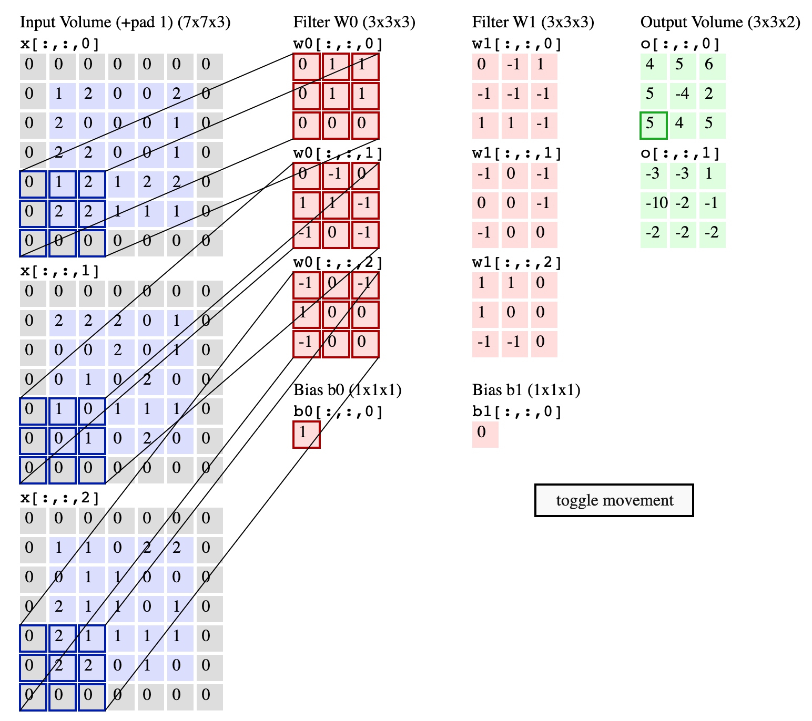

# Implementation Notes

## Convolutional Layer

The input tensor has shape: `(batch_size, in_channels, height, width)`. Each image in the batch may have multiple input channels (e.g., RGB has 3), and convolution is performed per-channel and then summed across.



### Forward Step 1: Padding

We use zero padding for the padding operation. The effective shape of the input tensor after padding will be `(batch_size, in_channels, height + 2 * padding, width + 2 * padding)`.

```python
if self.padding > 0:
    padded_input = np.zeros((batch_size, in_channels, height + 2 * self.padding, width + 2 * self.padding))
    padded_input[:, :, self.padding:-self.padding, self.padding:-self.padding] = input
    input = padded_input
```

### Forward Step 2: Output size

```python
out_height = (height - self.kernel_size) // self.stride + 1
out_width = (width - self.kernel_size) // self.stride + 1
output = np.zeros((batch_size, self.out_channels, out_height, out_width))
```

This utilizes the formula for calculating the output size of a convolutional layer:
$$
\text{Output Size} = \left\lfloor \frac{\text{Input Size} + 2 \cdot \text{Padding} - \text{Kernel Size}}{\text{Stride}} \right\rfloor + 1
$$

Output is created as a zero tensor.

### Forward Step 3: Sliding Window Convolution

Reference image: Vincent Dumoulin’s convolution arithmetic visualizations


```python
for out_x in range(out_height):
    for out_y in range(out_width):
        for kernel_x in range(self.kernel_size):
            for kernel_y in range(self.kernel_size):
                output[:, :, out_x, out_y] += np.sum(
                    input[:, None, :, out_x * self.stride + kernel_x, out_y * self.stride + kernel_y]
                    * self.kernel_weight[None, :, :, kernel_x, kernel_y],
                    axis=2
                )
        output[:, :, out_x, out_y] += self.kernel_bias[None, :]
```

The key idea: for each `(out_x, out_y)` output position, extract a sliding window from the input and multiply with the filter weights, summing over input channels. The value at `(out_x, out_y)` for the output is contributed by the kernel value at `(kernel_x, kernel_y)` and the input value at `(out_x * stride + kernel_x, out_y * stride + kernel_y)`.

Here, broadcasting is used to accelerate the multiplication. The shape is specified below:

- `input`: the element at the position has shape `(batch_size, in_channels)`. After adding a new axis, it becomes `(batch_size, 1, in_channels)`.
- `kernel_weight`: the element at the position has shape `(out_channels, in_channels)`. After adding a new axis, it becomes `(1, out_channels, in_channels)`
- `output`: the element has shape `(batch_size, out_channels)`

Summing over `axis=2` is done to collapse the input channels, resulting in the output shape of `(batch_size, out_channels)`.

### Backpropagation of the Convolutional Layer

The gradient of the input and the convolutional kernel can be computed in the main loop:

```python
for out_x in range(out_height):
    for out_y in range(out_width):
        for kernel_x in range(self.kernel_size):
            for kernel_y in range(self.kernel_size):
                # update input gradient
                padded_gradient[:, :, out_x * self.stride + kernel_x, out_y * self.stride + kernel_y] += np.sum(
                    output_gradient[:, :, out_x, out_y, None] * self.kernel_weight[None, :, :, kernel_x, kernel_y],
                    axis=1
                )
                
                # update kernel gradient
                self.kernel_gradient[:, :, kernel_x, kernel_y] += np.sum(
                    input[:, None, :, out_x * self.stride + kernel_x, out_y * self.stride + kernel_y] * output_gradient[:, :, out_x, out_y][:, :, None],
                    axis=0
                        )
```

Since the value at `(out_x, out_y)` for the output is contributed by the kernel value at `(kernel_x, kernel_y)` and the input value at `(out_x * stride + kernel_x, out_y * stride + kernel_y)`, we can compute the gradients by reversing this operation.

Notice that the `input` is obtained by caching it during the forward pass.

## Pooling Layer

The input tensor has shape: `(batch_size, in_channels, height, width)`.  Each channel in every image is pooled independently.

### Forward Step 1: Output size

```python
out_height = (height - self.kernel_size) // self.stride + 1
out_width = (width - self.kernel_size) // self.stride + 1
```

This utilizes the formula for calculating the output size of a convolutional layer:

$$
\text{output\_size} = \left\lfloor \frac{\text{input\_size} - \text{kernel\_size}}{\text{stride}} \right\rfloor + 1
$$


### Forward Step 2: Sliding Window Max Pooling

```python
for out_x in range(out_height):
    for out_y in range(out_width):
        output[:, :, out_x, out_y] = np.max(
            input[:, :, 
                  out_x * self.stride : out_x * self.stride + self.kernel_size,
                  out_y * self.stride : out_y * self.stride + self.kernel_size],
            axis=(2, 3)
        )
```

The key idea: for each `(out_x, out_y)` output position, extract a sliding window from the input and apply the max operation over the spatial region defined by the kernel size. The value at `(out_x, out_y)` for the output is the maximum value from the corresponding input slice: `(out_x * stride : out_x * stride + kernel_size, out_y * stride : out_y * stride + kernel_size)`.

### Backpropagation of the Pooling Layer

The gradient of the input can be computed in the main loop:

```python
for out_x in range(out_height):
    for out_y in range(out_width):
        max_index_mask = np.arange(self.kernel_size * self.kernel_size)[None, None, :] == max_indices[:, :, out_x, out_y][:, :, None]
        max_index_mask = max_index_mask.reshape(batch_size, in_channels, self.kernel_size, self.kernel_size)
        
        input_gradient[:, :, out_x * self.stride : out_x * self.stride + self.kernel_size, out_y * self.stride : out_y * self.stride + self.kernel_size] += output_gradient[:, :, out_x, out_y, None, None] * max_index_mask
```

Notice that the `max_indices` is obtained by caching it during the forward pass. For max pooling, only the maximum value in the pooling region contributes to the output, so we need to propagate the gradient only to that position. This is how `max_index_mask` is used.

## Other Layers

- Softmax: we implement it as log softmax.

$$
z_i:=\log \text{softmax}(x)_i = x_i - \log\left({\sum_{j} e^{x_j}}\right)
$$

for numerical stability, subtract the maximum value in the input vector before applying the exponential function.

For backpropagation:

$$
\frac{\partial \log z_i}{\partial x_j} = 1[i=j] - \frac{e^{x_j}}{\sum_{k} e^{x_k}}
$$

## Final Results

After training for 5 epochs on 1000 images (notice that due to the computational cost, we only train on a small subset of the MNIST dataset), the model achieves an accuracy of roughly 50% on the test set.